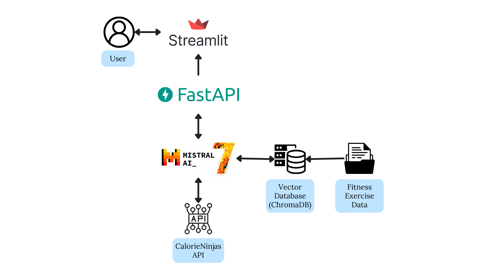

# Virtual Fitness Coach Project

Individual Project for AIPI 561: LLMOps

 
## Project Plan and Timeline

### Problem Statement
- Maintaining a consistent fitness routine is challenging due to lack of personalized guidance, motivation, and progress tracking. 
- Traditional fitness programs often fail to meet individual needs, leading to suboptimal results.

### Solution
The Virtual Fitness Coach provides personalized workout plans, real-time feedback, and continuous motivation using an AI-powered assistant.

### Benefit
Users will enjoy tailored workouts, improved motivation, and effective progress tracking. The portable application offers consistent support and guidance, helping users achieve their fitness goals anywhere, anytime.

### Development Phases and Timeline

- **Weeks 1-2: Planning**
  - Define project scope and key features.
  - Collect data for domain specialization
    - Videos and Images links for different exercises
    - Nutritional information for different food items, and sample meal plans
    - ...

- **Weeks 3-5: Backend Development**
  - Set up llama.cpp and Cosmopolitan.
  - Develop the local API endpoint.
  - Implement RAG for domain specialization.

- **Weeks 6-8: Frontend Development**
  - Design and develop the user interface.
  - Integrate with the local API endpoint.
  - Ensure responsive design.

- **Weeks 9-10: Containerization**
  - Package the application into a container.
  - Test for portability and functionality.
  - Prepare deployment documentation.

- **Weeks 11-12: Testing and QA**
  - Conduct thorough testing.
  - Gather test user feedback and make improvements.
  - Ensure performance and reliability.

  te

### Structure 

