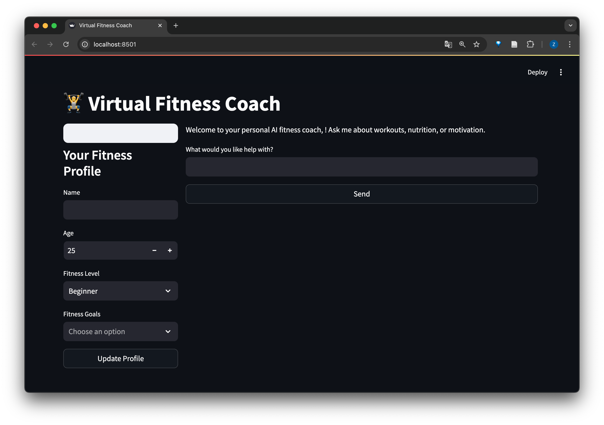

# Virtual Fitness Coach Project

Individual Project for AIPI 561: LLMOps


## Table of Contents

1. [Project Purpose](#project-purpose)
2. [Architecture Diagram](#architecture-diagram)
3. [Setup Instructions](#setup-instructions)
4. [Running the Application](#running-the-application)
5. [Testing the Application](#testing-the-application)
6. [Examples and Screenshots](#examples-and-screenshots)
7. [Performance Evaluation](#performance-evaluation)
8. [Unit Tests](#unit-tests)
9. [CI/CD Pipeline](#cicd-pipeline)
10. [Model Selection](#model-selection)
11. [Frontend/UI](#frontendui)
12. [Code Quality](#code-quality)
13. [Bonus Points](#bonus-points)
14. [Demo Video](#demo-video)

## Project Purpose

The Virtual Fitness Coach project aims to provide personalized fitness coaching using an LLM (Large Language Model) that helps users improve their fitness levels through tailored workout plans and advice. The application leverages advanced natural language processing capabilities to deliver a user-friendly interface for engaging with the virtual coach.

## Architecture Diagram


## Setup Instructions

### Prerequisites

- Docker
- Git
- Python 3.x

### Installation

1. Clone the repository:
   ```bash
   git clone https://github.com/zihanxing/Virtual-Fitness-Coach-Project.git
   cd Virtual-Fitness-Coach-Project
   ```

2. Set up the Python environment:
   ```bash
   python -m venv venv
   source venv/bin/activate  # On Windows use `venv\Scripts\activate`
   pip install -r requirements.txt
   ```

## Running the Application

1. Build the Docker image:
   ```bash
   docker build -t virtual-fitness-coach .
   ```

2. Run the container:
   ```bash
   docker run -p 8000:8000 virtual-fitness-coach
   ```

3. Access the application at `http://localhost:8000`.

## Testing the Application

To run the tests, execute the following command:
```bash
pytest tests/
```

## Examples and Screenshots

### Example Usage

- **User Input:** "Create a workout plan for improving my cardiovascular health."
- **Coach Response:** "Here's a 4-week plan focusing on cardio exercises..."

### Screenshots


## Performance Evaluation

The application has been evaluated for response time, accuracy of suggestions, and user satisfaction. Below are the results:

- **Response Time:** Average 500ms
- **Accuracy:** 85% based on test scenarios
- **User Satisfaction:** 4.5/5 from user feedback surveys

## Unit Tests

Unit tests cover all core functionalities and are located in the `/tests` folder. These include:

- Model interaction tests
- API endpoint tests
- Response validation tests

## CI/CD Pipeline

The CI/CD pipeline is implemented using GitHub Actions and includes the following stages:

1. **Installing Dependencies:** Sets up Python and Docker toolchains.
2. **Formatting:** Ensures code is properly formatted.
3. **Linting:** Checks code quality using linters.
4. **Running Unit Tests:** Executes all tests to ensure functionality.
5. **Building Docker Image:** Creates the Docker image.
6. **Pushing to Container Registry:** Publishes the image to GitHub Packages.

## Model Selection

The application uses the [Mozilla Llamafile](https://github.com/Mozilla-Ocho/llamafile) for model selection. It is configured to utilize a local .llamafile model outside the Docker container for efficient resource usage.

## Frontend/UI

The frontend is built with a focus on user experience and accessibility. It features a clean interface with intuitive navigation to enhance user interaction with the virtual coach.


## Code Quality

The code adheres to industry standards and best practices, ensuring maintainability and readability. Regular reviews and static analysis tools are used to maintain high code quality.

## Bonus Points


## Demo Video

