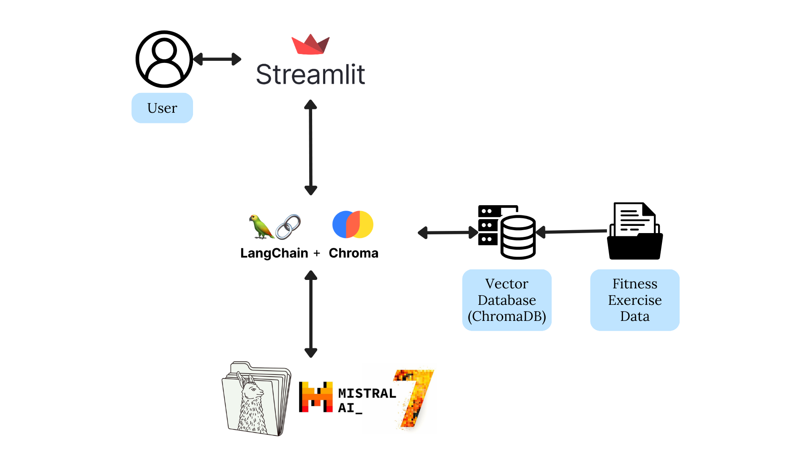

# Virtual Fitness Coach Project

Individual Project for AIPI 561: LLMOps


## Table of Contents

1. [Project Purpose](#project-purpose)
2. [Architecture Diagram](#architecture-diagram)
3. [Project Structure](#project-structure)
3. [Setup Instructions](#setup-instructions)
4. [Running the Application](#running-the-application)
6. [Examples and Screenshots](#examples-and-screenshots)
7. [Performance Evaluation](#performance-evaluation)
8. [Unit Tests](#unit-tests)
9. [CI/CD Pipeline](#cicd-pipeline)
10. [Model Selection](#model-selection)
14. [Demo Video](#demo-video)

## Project Purpose

The Virtual Fitness Coach project aims to provide personalized fitness coaching using an local LLM based on llamafile. The application allows users to interact with the virtual coach, receive tailored workout plans with detailed demonstration guides (including videos), based on their fitness goals and preferences. The project leverages the Mozilla Mistral-7B-Instruct-v0.2 model to generate workout plans and instructions for users.

## Architecture Diagram


## Project Structure
```plaintext
.
├── Dockerfile
├── README.md
├── assets
├── chroma_langchain_db   # Persistent storage for functional database
│   └── chroma.sqlite3
├── data
├── load_test.py         # Load testing script
├── main_page.py        # Main application file to run the service
├── performance_test.py # Performance testing script
├── requirements.txt
├── tests              # Unit tests
│   ├── __init__.py
│   └── test_main_page.py
└── vector_database_setup.py # Setup file for the vector database
```

## Setup Instructions

### Prerequisites

- Docker
- Git
- Python 3.10

### Installation

1. Clone the repository:
   ```bash
   git clone https://github.com/zihanxing/Virtual-Fitness-Coach-Project.git
   cd Virtual-Fitness-Coach-Project
   ```

2. Set up the Python environment:
   ```bash
   python -m venv venv
   source venv/bin/activate  # On Windows use `venv\Scripts\activate`
   pip install -r requirements.txt
   ```

3. Download the model from this link: [mistral-7b-instruct-v0.2.Q5_K_M.llamafile](https://huggingface.co/Mozilla/Mistral-7B-Instruct-v0.2-llamafile/resolve/main/mistral-7b-instruct-v0.2.Q5_K_M.llamafile)

4. Make the model executable:
    ```bash
    chmod +x ./mistral-7b-instruct-v0.2.Q5_K_M.llamafile
    ```
5. Run the model server on port 8080, and enable embedding:
    ```bash
    ./mistral-7b-instruct-v0.2.Q5_K_M.llamafile --server --nobrowser --embedding --port 8080
    ```

## Running the Application

1. Build the Docker image:
   ```bash
   docker build -t virtual-fitness-coach .
   ```

2. Run the container:
   ```bash
   docker run -p 8000:8000 virtual-fitness-coach
   ```

3. Access the application at `http://localhost:8000`.

## Examples and Screenshots

### Case for muscle building

### Case for weight loss


## Performance Evaluation
### Output Speed
By running the `performance_test.py` script, I evaluate the model's performance using the following metrics:

- Average Speed: 15.06 tokens/second

To compare the performance with a different model, here is the similar metrics for GPT-4 API:

- **Average Output Speed:** 25.1 tokens/second.

The performance of the model is satisfactory for the application's requirements, providing a good user experience.

### Load Testing

Using `load_test.py`, we conducted load testing to evaluate the scalability and performance of the Virtual Fitness Coach chatbot under various conditions. The tests were run on a machine with the following specifications:

- **Python Version:** 3.10.14
- **Operating System:** Darwin 23.5.0
- **Machine:** arm64

#### Test Results

| Test Configuration                          | Requests | Concurrent Workers | Total Time (s) | Successful Requests | Requests per Second | Average Latency (s) | Average Speed (tokens/s) | Average Tokens per Response | Min Latency (s) | Max Latency (s) |
|---------------------------------------------|----------|--------------------|----------------|---------------------|---------------------|---------------------|--------------------------|---------------------------|-----------------|-----------------|
| **Test 1**                                  | 2        | 2                  | 40.58          | 2                   | 0.05                | 39.88               | 7.50                     | 299.50                    | 39.18           | 40.58           |
| **Test 2** *(Timeout Errors)*               | 4        | 4                  | N/A            | 0                   | N/A                 | N/A                 | N/A                      | N/A                       | N/A             | N/A             |
| **Test 3**                                  | 4        | 2                  | 99.75          | 4                   | 0.04                | 45.70               | 8.67                     | 384.00                    | 32.70           | 60.51           |

#### Discussion

- **Test 1:** Successfully handled 2 requests with 2 concurrent workers, achieving an average latency of 39.88 seconds and an average speed of 7.50 tokens per second.

- **Test 2:** With 4 requests and 4 concurrent workers, all requests timed out, indicating limitations in handling multiple simultaneous requests on the current hardware setup.

- **Test 3:** With 4 requests and 2 concurrent workers, the system processed all requests successfully. The average latency increased to 45.70 seconds, and the average speed improved to 8.67 tokens per second.

#### Observations

- **Scalability:** The system performs well with a smaller number of concurrent requests but encounters timeouts with higher concurrency.

- **Performance Consistency:** As the number of concurrent workers increases, latency becomes a significant factor affecting performance. Deploying the model server on a more powerful machine or utilizing cloud resources could help address these challenges.


## Unit Tests

The unit tests are located in the tests directory and include the following:

- Profile Update Test: Verifies that user profile details (name, age, fitness level, and goals) can be updated correctly.
- Chat History Test: Ensures that user messages are properly added to the chat history.
- Response Generation Test: Simulates the language model's response generation and checks that the assistant's messages are correctly formatted and stored.

By running `pytest tests` at the root of the project, you can execute all unit tests and view the results:

```bash
$ pytest tests/test_main_page.py
============================================================================================= test session starts ==============================================================================================
platform darwin -- Python 3.10.14, pytest-8.3.2, pluggy-1.5.0
rootdir: /Users/xzh/Desktop/AIPI561/Virtual-Fitness-Coach-Project
plugins: asyncio-0.23.8, cov-5.0.0, anyio-4.4.0, mock-3.14.0
asyncio: mode=strict
collected 3 items                                                                                                                                                                                              

tests/test_main_page.py ...                                                                                                                                                                              [100%]

============================================================================================== 3 passed in 0.74s ===============================================================================================
```
## CI/CD Pipeline

The CI/CD pipeline is implemented using GitHub Actions and includes the following stages:

1. **Installing Dependencies:** Sets up Python and Docker toolchains.
2. **Formatting:** Ensures code is properly formatted.
3. **Linting:** Checks code quality using linters.
4. **Running Unit Tests:** Executes all tests to ensure functionality.
5. **Building Docker Image:** Creates the Docker image.
6. **Pushing to Container Registry:** Publishes the image to GitHub Packages.

## Model Selection

The application uses the Mozilla Mistral-7B-Instruct-v0.2 model to generate workout plans and instructions for users. It is the smallest model available that provides the necessary functionality for the Virtual Fitness Coach application, while maintaining a decent output speed and performance (compared to Meta-Llama-3.1-8B-Instruct and larger models).

## Demo Video

